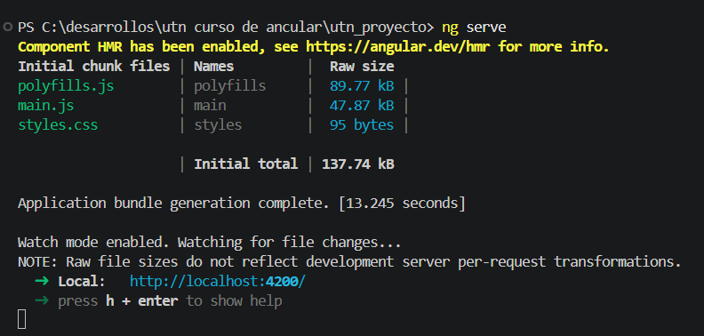
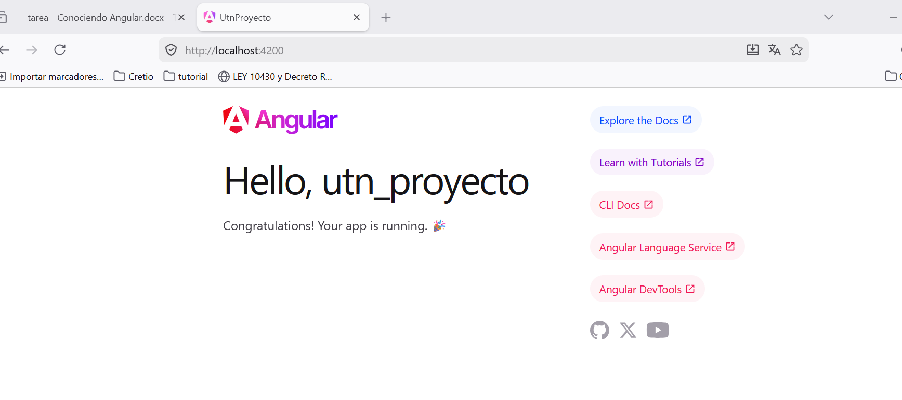
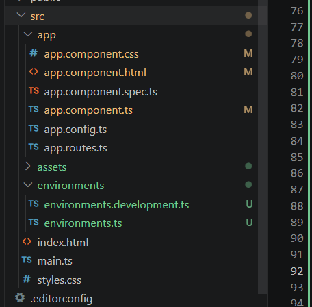
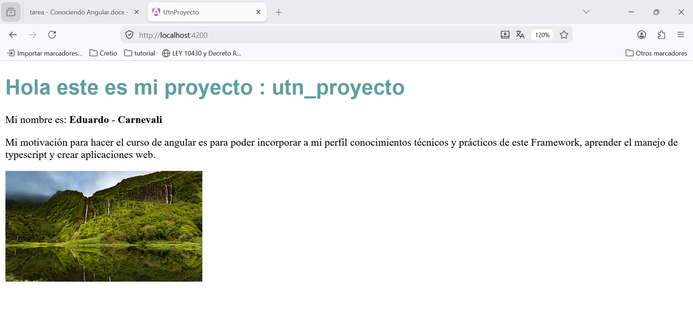
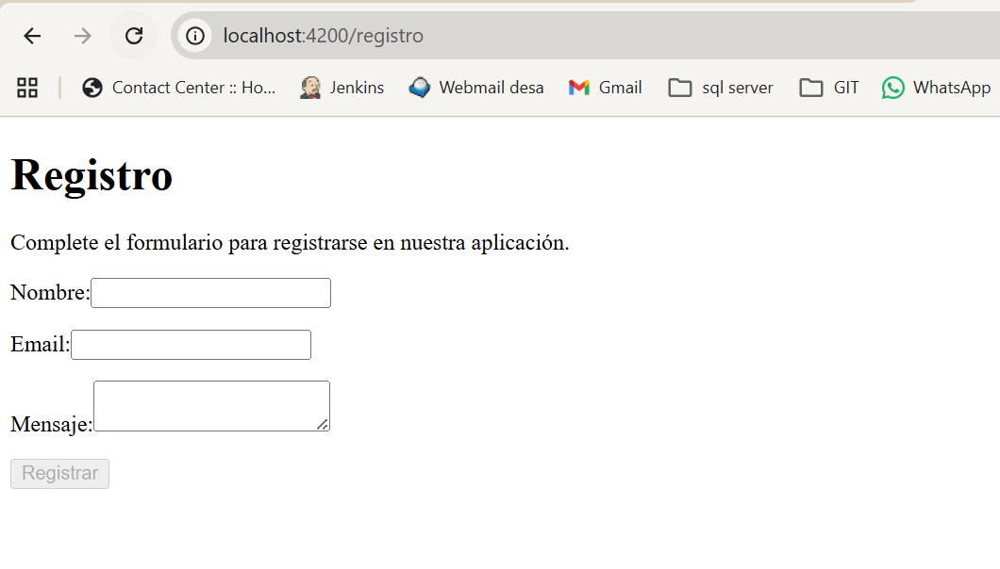
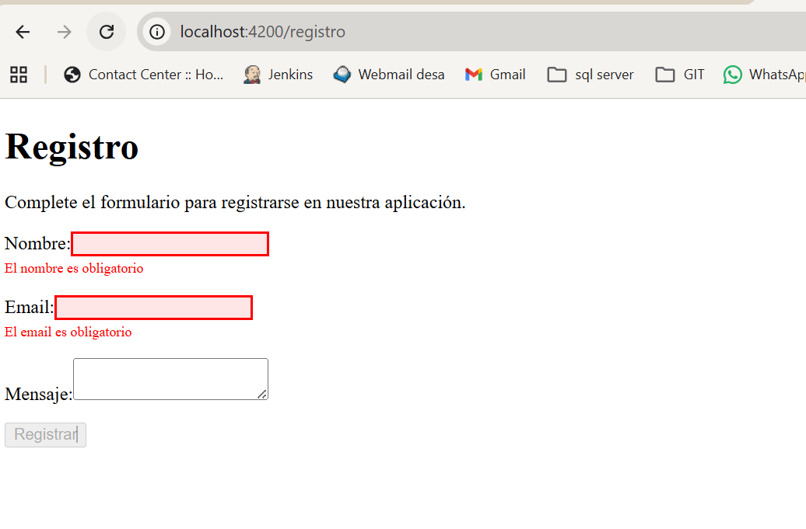
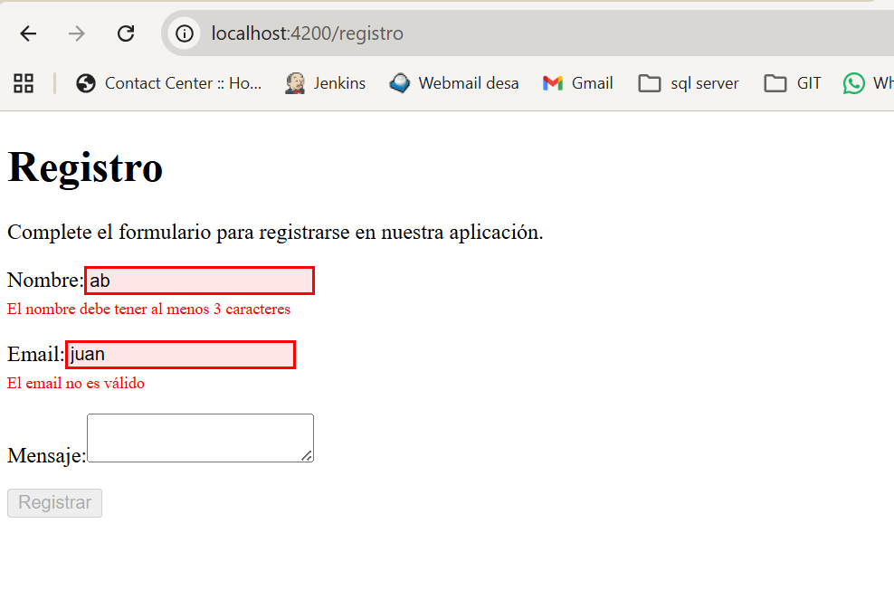

# UtnProyecto

This project was generated using [Angular CLI](https://github.com/angular/angular-cli) version 19.2.5.

## Development server

To start a local development server, run:

```bash
ng serve
```

Once the server is running, open your browser and navigate to `http://localhost:4200/`. The application will automatically reload whenever you modify any of the source files.

## Code scaffolding

Angular CLI includes powerful code scaffolding tools. To generate a new component, run:

```bash
ng generate component component-name
```

For a complete list of available schematics (such as `components`, `directives`, or `pipes`), run:

```bash
ng generate --help
```

## Building

To build the project run:

```bash
ng build
```

This will compile your project and store the build artifacts in the `dist/` directory. By default, the production build optimizes your application for performance and speed.

## Running unit tests

To execute unit tests with the [Karma](https://karma-runner.github.io) test runner, use the following command:

```bash
ng test
```

## Running end-to-end tests

For end-to-end (e2e) testing, run:

```bash
ng e2e
```

Angular CLI does not come with an end-to-end testing framework by default. You can choose one that suits your needs.

## Additional Resources

For more information on using the Angular CLI, including detailed command references, visit the [Angular CLI Overview and Command Reference](https://angular.dev/tools/cli) page.
# 2026_UTN_Angular


Practia M1
1 Creacion de proyecto
    --> instalar Angular cli
        ejecuto el comando npm install -g @angular/cli
    --> crear un nuevo proyecto
        ejecuto el comando ng new UTN_PROYECTO
    --> ejecutar el proyecto
        con el comando ng serve





2 Exploración de la estructura
    -->Identificar las carpetas y archivos más importantes
        scr/app : logica principal, aqui crearemos los componentes 
                                ng generate component nombre_componente
                    se creara una carpeta "nombre_componente" y los archivos nombre_componente.html, nombre_componente.ts, 
                    nombre_componente.css y nombre_componente.spec.ts
                    tambien crearemos los servicios y los modulos
        app.component.ts : componete principal, este componente es el <app-root></app-root> que llamaremos desde el index.html, 
                    punto de entrada de la app
        app.module.ts : es el modulo raiz, agrupa componentes, modulos, servicios y dependencias de la app, este define que componentes 
                    se cargaran y que modulos se importan 
        assets : aquí colocaremos las imagenes, iconos, fuentes, etc. recursos estáticos
        environments : configuración por entorno, dependiendo el ambiente que estemos ejecutando tomara distintos valores de configuración
                    por ejemplo conexión a la base de datos
                            environment.development configuración de entorno de desarrollo
                            environment.production configuración de entorno de produción

        
Imgen de mi app funcionado



Practica M2

sen agrega un nuevo componente registro


Se agrega un titulo con una descripcion y se crea un formulario

el campo nombre es obligatorio y tiene que tener mas de 3 caracteres
el campo email es obligatorio y tiene que tener un formato valido
el boton regisrar se desabilita hasta que el formulario sea valido
se utiliza ngClass para cambiar el color de los campos con error


cuando el formulario es valido se habilita el boton registrar


se muestra un mensaje de exito con el titulo en color verde utilizando el ngStyle y los campos ingresados se muestran en consola


